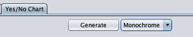

astah* Yes/No Chart Plugin
===============================

Version
----------------
1.0

Available for
----------------
astah* professional 8.0 or later

Description
----------------
This is a plugin to generate so-called "Yes/No Chart" (or "Yes/No diagram").
First, you draw a model of a Yes/No chart with an activity diagram, then the plugin can generate Yes/No chart in a power point file format.

How to install
----------------

0. Download .jar file from
   https://github.com/ChangeVision/astah-yesno-chart-plugin/releases/download/v1.0/astah-yesno-chart-plugin-1.0.jar
1. Launch Astah and drag the downloaded .jar file to an open instance of Astah.  A pop-up will appear asking you to confirm installation, choose [Yes].
2. If the pop-up opens, restart Astah and open any project.
3. Now you will have [Yes/No Chart] Tab in the Extension View below the Diagram

How to use
----------------
### Create a project file
As usual, create an Astah project file.  Remark that the power point file generated by this plugin will be placed at the same folder of the Astah project file.  The name of the generated power point file is fixed and even if there exists a file of the same name, the plugin will overwrite without any notification.

### Draw a model
In Astah, first you a model of a Yes/No chart in an activity diagram.

Try to draw the following model.

This Yes/No chart model consists of one question and two conclusions.
For this plugin, both question and conclusion are expressed by actions
and the selections of yes or no are represented by control flows with guard conditions.
Here, push the "Generate" button in the Yes/No chart plugin extension view.

That is the button shown above.

After a while, you will see the message "pptx file is created!".
Then, check out the folder at where the Astah project file is located.
You will see the file "generatedYesNoChart.pptx" is created.
Let's see the contents.

As you see, a diagram in a power point file is created based on a model in an activity diagram.
Let's construct some more complicated Yes/No chart.

A branch in Yes/No chart can be represented in two ways in an activity diagram. 
The first is an action directly connected with two control flows with guard conditions.
The action "I usually eat more bread for breakfasts than rice" is this type.
A guard condition can be arbitrary text other than "yes" or "no".
The other type is an action connected with a decision node that is the source of two control flows with guard conditions.
For example, the action "You are a morning person or night person?" is that type.

The generated Yes/No chart in a power point file format has no difference for those types.  You can use whichever representation you prefer.
Let us see the Yes/No chart generated from the activity diagram above.

Although you might recognize some diagram elements are overlapped, you can see the translation has been succeeded.  From this diagram as a basis, you can align diagram elements and make up your own Yes/No chart.

### Others
* The generated arrows for yes or no in a power point diagram are not connected to rectangle diagram elements.
* The plugin also has a monochrome mode.

    - After choosing "Monochrome" at the pull-down menu beside the "Generate" button, try to push "Generate" button.

License
---------------
Copyright 2021 Change Vision, Inc.

Licensed under the Apache License, Version 2.0 (the "License");
you may not use this work except in compliance with the License.
You may obtain a copy of the License in the LICENSE file, or at:

<http://www.apache.org/licenses/LICENSE-2.0>

Unless required by applicable law or agreed to in writing, software
distributed under the License is distributed on an "AS IS" BASIS,
WITHOUT WARRANTIES OR CONDITIONS OF ANY KIND, either express or implied.
See the License for the specific language governing permissions and
limitations under the License.

