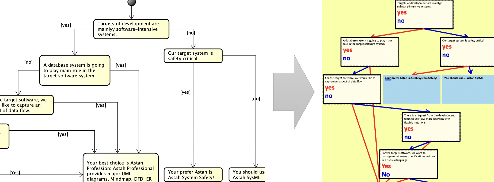
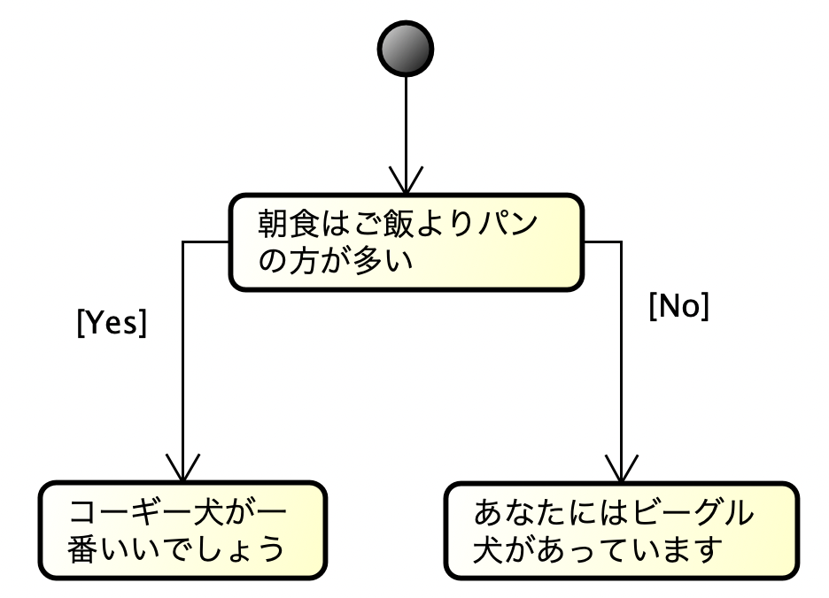
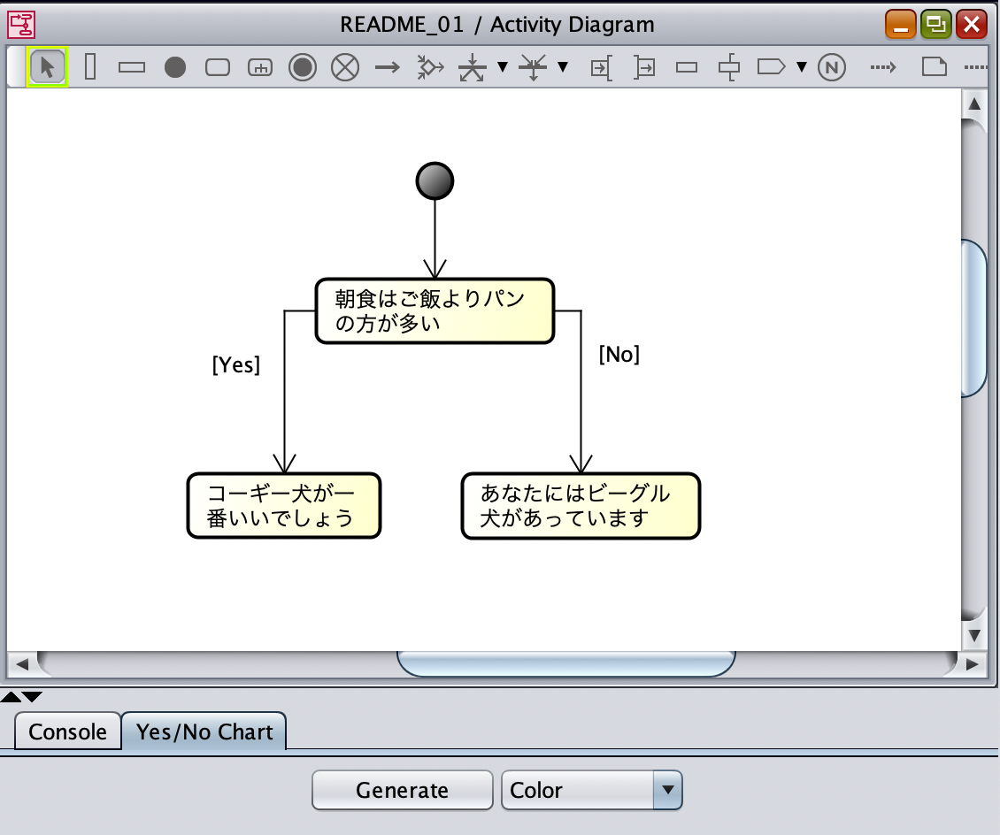
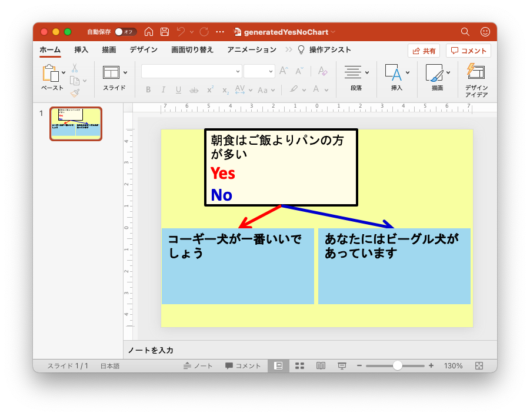
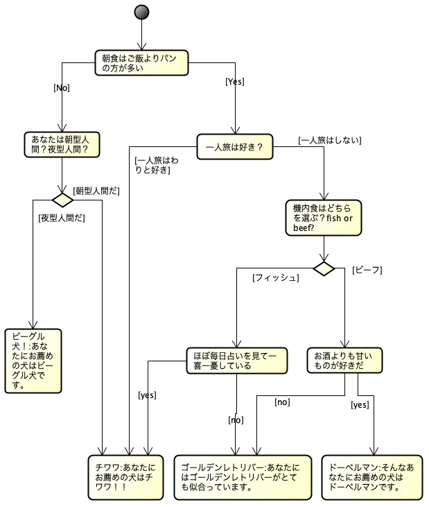
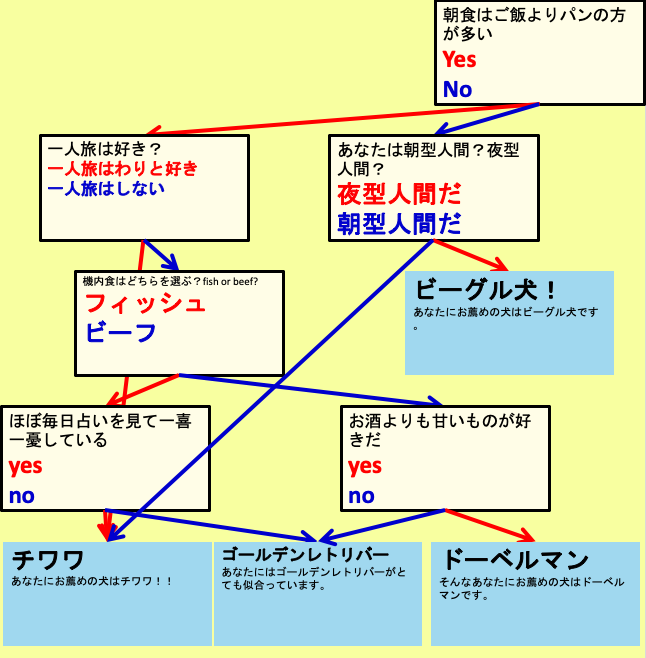
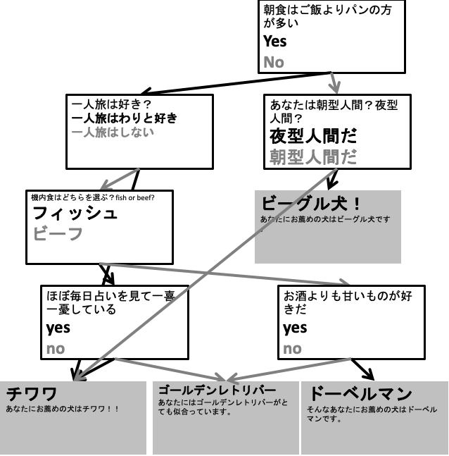
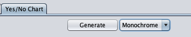

astah* Yes/No Chart プラグイン
===============================

Version
----------------
1.0

Available for
----------------
astah* professional 8.0 or later

Description
----------------
いわゆるYes/Noチャート（またはYes/No図）を書くためのプラグインです。
アクティビティ図でYes/Noチャートのモデルを書くことによって、パワーポイント形式のYes/Noチャートを出力することができます。

How to install
----------------

0. 以下から .jarファイルをダウンロードしてください。
   https://github.com/ChangeVision/astah-yesno-chart-plugin/releases/download/v1.0/astah-yesno-chart-plugin-1.0.jar
1. 上部メニュー[ヘルプ] – [プラグイン一覧] からプラグイン一覧を開きます。
2. [インストール] ボタンをクリックし、jarファイルを選択してインストールしてください。
3. astah* を再起動し、プロジェクトを開きます。
4. 下部の拡張ビューに[Yes/No Chart]タブが追加されます。

使い方
----------------
### プロジェクトファイルを作成する
通常の通りastah* のプロジェクトを作成してください。注意点として、astah* のアクティビティ図から変換されるパワーポイントファイルは、固定のファイル名でastah* のプロジェクトファイルがあるフォルダと同じ場所に生成されます。もし既にそのファイルが存在している場合には、特に確認せず上書きします。
### モデルを書く
はじめに、Yes/Noチャートのモデルをアクティビティ図で書きます。

次のようなモデルを書いてみましょう。

これは、Yes/Noチャートとしては、質問が一つ、最終的な結論が二つからなるものです。アクティビティ図では、質問も結論もアクションによって表現し、YesやNoの選択は、フローに対するガードによって表現します。
ここで、Yes/No拡張タブにあるGenerateボタンを押してみましょう。

ここのボタンです。

しばらく待っていると、「pptx file is created!」というメッセージが表示されると思います。ここで，astah* のプロジェクトファイルがあるフォルダを見てみましょう。「generatedYesNoChart.pptx」というファイルが作成されているはずです。中を見てみましょう。

このように，astah* のアクティビティ図を元にしたパワーポイントでの図が作成されています。
もう少し複雑なYes/Noチャートを書いてみましょう。

アクティビティ図におけるYes/Noチャートの分岐はのところは，二種類の書き方が可能です。
一つは，アクションから遷移が二つのガード付きのコントロールフローが直接でている場合です。アクション「朝食はご飯よりパンの方が多い」がこれに対応します。ガードは，「Yes」や「No」以外にも任意のものがかけます。もう一つは，アクションから一つだけコントロールフローがでて，ディシジョンノードにつながり，そのディシジョンノードから二つのガード付きコントロールフローがでている場合です。上のアクティビティ図でいうと，「あなたは朝型人間？夜型人間？」がそれに相当します。これら二つの表現は，生成されるYes/Noチャートにおける違いはありません。どちらでもお好みの表現を利用できます。
それでは上のアクティビティ図を変換したYes/Noチャートを見てみましょう。

すこし矢印などが重なっているところはありますが，変換はできていることは確認できると思います。ここからレイアウトや矢印の線をコネクタなどに変換して，お好みのYes/Noチャートを作る土台としてください。

### その他
* 生成されたパワーポイントのyesやnoの矢印線について，四角形の図形とは接続していませんのでご注意ください。
* 白黒モードもあります。

    - Generateボタンの横のプルダウンメニューを，Monochromeを選んだ上でGenerateボタンをしてみてください。

License
---------------
Copyright 2021 Change Vision, Inc.

Licensed under the Apache License, Version 2.0 (the "License");
you may not use this work except in compliance with the License.
You may obtain a copy of the License in the LICENSE file, or at:

<http://www.apache.org/licenses/LICENSE-2.0>

Unless required by applicable law or agreed to in writing, software
distributed under the License is distributed on an "AS IS" BASIS,
WITHOUT WARRANTIES OR CONDITIONS OF ANY KIND, either express or implied.
See the License for the specific language governing permissions and
limitations under the License.

